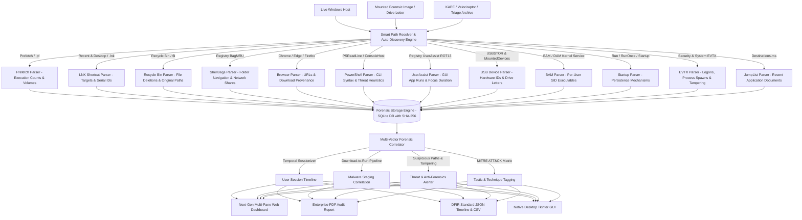

# 🐾 Footprint Analyzer - Windows Forensic Artifacts Parser & User Activity Reconstruction Platform (v1.3.4)

[](https://github.com/chinmayiM-bhise/Windows-User-Activity-Reconstruction-Tool/actions/workflows/ci.yml)
[](https://www.python.org/)
[](https://github.com/chinmayiM-bhise/Windows-User-Activity-Reconstruction-Tool)
[](https://www.microsoft.com/windows)
[](https://opensource.org/licenses/MIT)

> **Footprint Analyzer** is an automated, enterprise-grade Digital Forensics and Incident Response (DFIR) platform designed to parse, correlate, and reconstruct user activity and attack timelines from Windows operating systems, live triage, and mounted forensic images. Discovers and parses 12+ artifact types, correlates multi-vector attack chains (Download → Run → Anti-Forensics) with MITRE ATT&CK tagging, and exports compliance-ready **DFIR JSON Timelines**, **Standardized CSVs**, and **Enterprise PDF Forensic Audit Reports**.

---

## ⚡ 1-Click Cloud Launch

Launch and explore the platform directly in your browser without installing anything locally:

[](https://codespaces.new/chinmayiM-bhise/Windows-User-Activity-Reconstruction-Tool)

---

## 🏛️ System Architecture



---

## ✨ Key Capabilities

| Engine | Module | Description |
| :--- | :--- | :--- |
| **Smart Path Resolver** | [`path_resolver.py`](file:///D:/Github%20projects/windows-artifacts-parser-v1.2.8/windows-artifacts-parser/parsers/path_resolver.py) | Auto-resolves live Windows paths (`%SystemRoot%`, `%APPDATA%`) and recursively crawls mounted drives (`E:\`) and triage dumps without manual path entry. |
| **Browser Forensics** | [`browser_parser.py`](file:///D:/Github%20projects/windows-artifacts-parser-v1.2.8/windows-artifacts-parser/parsers/browser_parser.py) | Parses Chrome, Edge, Brave, Opera, and Firefox SQLite databases for visited URLs, page titles, visit counts, and file downloads with safe lock handling. |
| **PowerShell Threat Hunter** | [`powershell_parser.py`](file:///D:/Github%20projects/windows-artifacts-parser-v1.2.8/windows-artifacts-parser/parsers/powershell_parser.py) | Recovers full `ConsoleHost_history.txt` commands and flags IEX, encoded commands, web cradles, Mimikatz, and shadow copy deletion. |
| **UserAssist Decoder** | [`userassist_parser.py`](file:///D:/Github%20projects/windows-artifacts-parser-v1.2.8/windows-artifacts-parser/parsers/userassist_parser.py) | Decodes ROT13 Registry keys to extract GUI program execution counts, application focus counts, and active focus time in seconds. |
| **USB & Storage Tracker** | [`usb_parser.py`](file:///D:/Github%20projects/windows-artifacts-parser-v1.2.8/windows-artifacts-parser/parsers/usb_parser.py) | Reconstructs USBSTOR device history, serial numbers, vendor/product descriptors, volume GUIDs, and assigned drive letters. |
| **Kernel Execution Monitor** | [`bam_parser.py`](file:///D:/Github%20projects/windows-artifacts-parser-v1.2.8/windows-artifacts-parser/parsers/bam_parser.py) | Parses Windows Background Activity Moderator (BAM/DAM) for kernel-verified executable paths and last run times per User SID. |
| **Security Event Auditor** | [`evtx_parser.py`](file:///D:/Github%20projects/windows-artifacts-parser-v1.2.8/windows-artifacts-parser/parsers/evtx_parser.py) | Analyzes Logon (4624/4625), Process Spawns (4688), New Services (7045), PowerShell Script Blocks (4104), and Log Cleared alerts (1102). |
| **Multi-Vector Correlator** | [`correlator.py`](file:///D:/Github%20projects/windows-artifacts-parser-v1.2.8/windows-artifacts-parser/correlator.py) | Chains multi-stage attacks (e.g. Browser Download → Temp Execution → Log Tampering) into sessionized timelines with MITRE ATT&CK tags. |
| **Enterprise Reporter** | [`report_gen.py`](file:///D:/Github%20projects/windows-artifacts-parser-v1.2.8/windows-artifacts-parser/parsers/report_gen.py) | Generates publication-ready executive PDF audit reports with SHA-256 database verification, examiner metadata, and timeline activity charts. |

---

## 🚀 Quickstart Guide

### Option 1: Run Modern Cyber Web Dashboard (Recommended)

#### 1. Setup & Installation
```bash
# Clone the repository
git clone https://github.com/chinmayiM-bhise/Windows-User-Activity-Reconstruction-Tool.git
cd Windows-User-Activity-Reconstruction-Tool

# Create and activate virtual environment
python -m venv venv
.\venv\Scripts\activate  # On Linux/macOS: source venv/bin/activate

# Install forensic dependencies
pip install -r requirements.txt
```

#### 2. Launch Web Server
```bash
python app.py
```
Open **[http://localhost:5000](http://localhost:5000)** in your browser.

---

### Option 2: Run Native Desktop GUI

For standalone native Windows desktop analysis without a web browser:

```bash
python main.py
```

---

## 💻 Enterprise CLI Usage

For headless automation, triage scripts, or CI/CD pipelines:

```bash
# Run 1-Click Live System Triage
python -c "import core_logic; res = core_logic.parse_live_triage_core(); print(res['message'])"

# Intelligently scan an external mounted drive or triage directory
python -c "import core_logic; res = core_logic.parse_target_folder_core(r'E:\ForensicDump'); print(res['message'])"

# Export standard reports
python -c "import core_logic; core_logic.generate_csv_report('timeline.csv'); core_logic.export_json_report('timeline.json')"
```

### Generated Audit Artifacts:
- `AegisDFIR_Audit_Report.pdf` — Publication-ready executive forensic security report with SHA-256 verification.
- `timeline.json` — Machine-readable DFIR Standard JSON timeline.
- `timeline.csv` — Standardized CSV for Excel and Timeline Explorer.

---

## 🔍 Real-World Compatibility Matrix

| Forensic Artifact Category | Standard Windows Location | Forensic Significance | Status |
| :--- | :--- | :--- | :---: |
| **Prefetch Files** | `%SystemRoot%\Prefetch\*.pf` | Binary execution, run counts, volume info, timestamps | ✅ Supported |
| **Shortcut (LNK) Files** | `%APPDATA%\Microsoft\Windows\Recent\*.lnk` | File access, target volume serials, creation dates | ✅ Supported |
| **Recycle Bin Metadata** | `%SystemDrive%\$Recycle.Bin\*\$I*` | Deleted file recovery, original paths, deletion time | ✅ Supported |
| **Explorer ShellBags** | `HKCU\Software\Microsoft\Windows\Shell\BagMRU` | Folder navigation history (local, network, removable) | ✅ Supported |
| **Web Browsers** | Chrome, Edge, Brave, Opera `History`, Firefox `places.sqlite` | Visited URLs, search queries, download provenance | ✅ Supported |
| **PowerShell History** | `%APPDATA%\Microsoft\Windows\PowerShell\PSReadLine\*.txt` | Attacker CLI commands, encoded payloads, Lolbins | ✅ Supported |
| **UserAssist (ROT13)** | `HKCU\Software\Microsoft\Windows\CurrentVersion\Explorer\UserAssist` | GUI app execution count, focus time, last run date | ✅ Supported |
| **USB & Storage Devices** | `HKLM\SYSTEM\CurrentControlSet\Enum\USBSTOR`, `MountedDevices` | USB device connection history, serials, drive letters | ✅ Supported |
| **BAM / DAM Kernel Monitor** | `HKLM\SYSTEM\CurrentControlSet\Services\bam\State\UserSettings` | Kernel-level executable execution per User SID | ✅ Supported |
| **Startup & Autoruns** | `HKLM\...\Run`, `HKCU\...\Run`, Startup Folders | Persistence mechanisms, malicious startup entries | ✅ Supported |
| **Windows Event Logs** | `%SystemRoot%\System32\Winevt\Logs\*.evtx` | Logons (4624/4625), process spawns, log clearing (1102) | ✅ Supported |
| **Jump Lists** | `%APPDATA%\Microsoft\Windows\Recent\AutomaticDestinations` | Recent files and documents opened per application | ✅ Supported |

---

## 🧪 Running Automated Tests

```bash
pytest -v
```

---

## 📜 License

Distributed under the **MIT License**. See `LICENSE` for more information.
